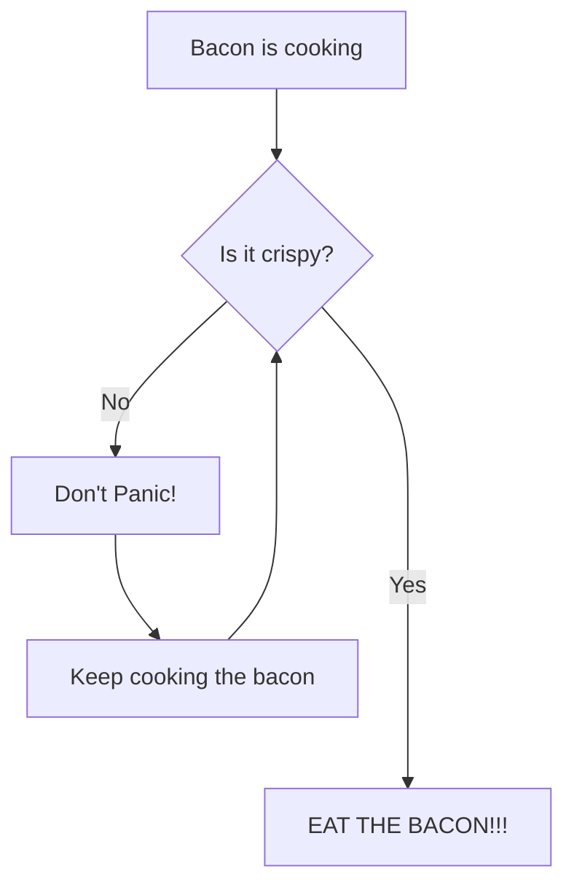

There are five entities and two choices in this Mermaid flow chart. "Bacon is cooking" starts my flow chart then going to entity B. If you go no, the entities go B-C-D-B. This is a loop the flowchart puts you in to get your bacon crispy. If you pick yes you go straight to
eat the bacon. the extra dashes after the "yes" choice get the flowchart line to go past the other branch.
